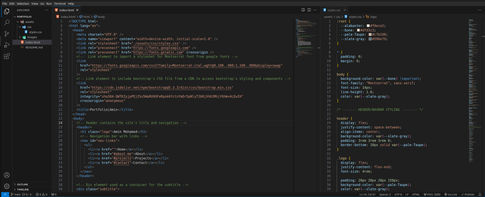
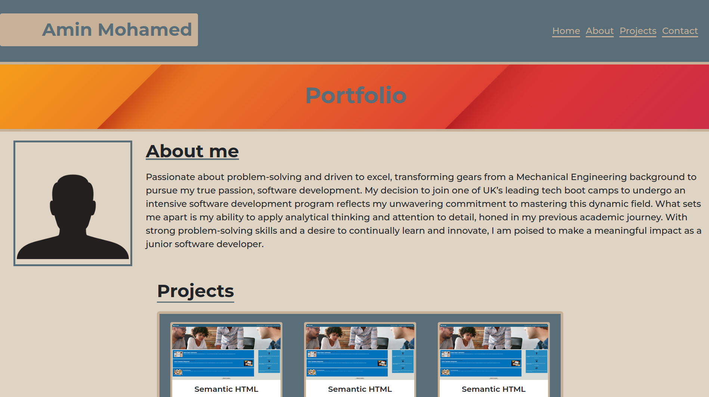

# 02 Advanced CSS: Portfolio

## Project Overview

The goal of this project was to develop a work portfolio showcasing my skills and accomplishments utilising advanced HTML and CSS techniques.

## Live Demo

To visit the live website, <a href="">click here</a>

## Key Features And Accomplishments

- Provided a concise and descriptive document title.

- Included semantic HTML elements such as `<header>, <nav>, and <footer>` to improve provide a clearer strucure.

- Displayed my name, a recent photo, and provided links to sections about myself, my work, and how to contact me.

- Implemented smooth scrolling functionality for navigation links, enabling a seamless user experience when navigating to different sections of the portfolio.

- Designed a dedicated section for showcasing my recent work, with titled images that clearly represent each project.

- Linked each application image to its respective deployed application, allowing users to easily access and review the projects.

- Ensured the entire portfolio layout is responsive, adapting to various screen sizes and devices to provide an optimal viewing experience across different platforms.

## Code Preview

## Website Preview

